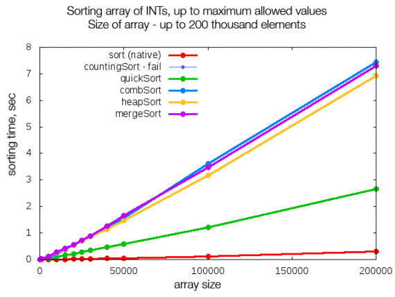

# AlgoNet

This project was built with the purpose of trying to figure out which sorting algorithm works best with different types of data arrays. Training data was self-generated up to 10000 in array size and a training set of 1 million. A neural network takes preprocessed data as input and generated 5 scores, one for each sorting algorithm in percentages. This preprocessing pipeline extracts time execution for each of the algorithms as well as array length and the number of composition pairs in an array. 

The mission was to accomplish, whether there is a unanimous algorithm that works best every single time in O(n*log n) time. 

## Contact and Acknowledgements

Please, feel free to reach out on [LinkedIn](https://www.linkedin.com/in/tim-cvetko-32842a1a6/) or [Gmail](tim@metawaveai.com).

## License

Licensed under the MIT [LICENSE](LICENSE)
